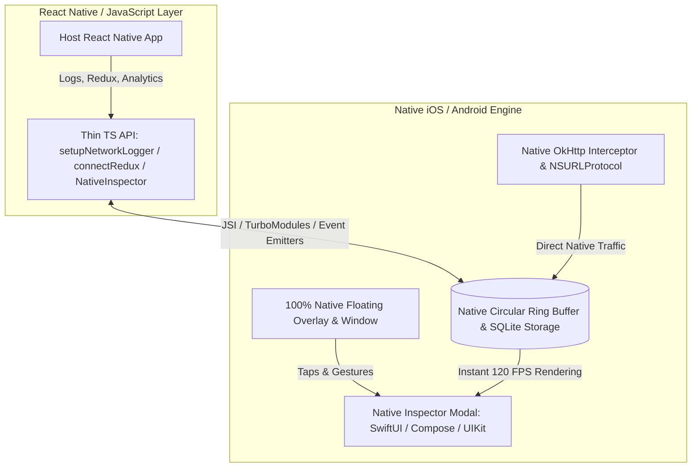

# React Native In-App Inspector

<p align="center">
  <picture>
    <source media="(prefers-color-scheme: light)" srcset="https://raw.githubusercontent.com/vengatmacuser/react-native-inapp-inspector/main/assets/banner_light.svg">
    <source media="(prefers-color-scheme: dark)" srcset="https://raw.githubusercontent.com/vengatmacuser/react-native-inapp-inspector/main/assets/banner_dark.svg">
    
  </picture>
</p>

<p align="center">
  <a href="https://www.npmjs.com/package/react-native-inapp-inspector"></a>
  <a href="https://www.npmjs.com/package/react-native-inapp-inspector"></a>
  <a href="https://bundlephobia.com/package/react-native-inapp-inspector"></a>
  <a href="https://github.com/vengatmacuser/react-native-inapp-inspector/blob/main/LICENSE"></a>
  <a href="https://github.com/vengatmacuser/react-native-inapp-inspector"></a>
  <a href="https://github.com/vengatmacuser/react-native-inapp-inspector"></a>
</p>

The **zero-config, all-in-one in-app debugging overlay for React Native & Expo**. Inspect network traffic (fetch/Axios), console logs with Metro symbolicated stack traces, Redux state diffs, Firebase Analytics events, and JavaScript bundle size directly on your device or simulator with zero native setup.

> 🚀 **The modern, lightweight alternative to Flipper and Chucker** — works standalone on device, in test builds, and across standalone APKs/IPAs without desktop companion apps, cables, or open debugger ports.

<p align="center">
  
</p>

---

## ⚡ Why Choose `react-native-inapp-inspector`?

| Capability | **react-native-inapp-inspector** | react-native-network-logger | Flipper / RN Debugger |
| :--- | :---: | :---: | :---: |
| **Native Module (Kotlin & iOS Bridge)** | ✅ | ❌ | ⚠️ |
| **Low-Level Hardware & RAM Telemetry** | ✅ | ❌ | ⚠️ |
| **Zero-Render Inactive Mode (0% Background Overhead)** | ✅ | ❌ | ❌ |
| **Network Timing Waterfall & P95 Telemetry** | ✅ | ❌ | ✅ |
| **Network Inspector (Fetch & Axios)** | ✅ | ✅ | ✅ |
| **cURL & Fetch Snippet Export** | ✅ | ❌ | ⚠️ |
| **Console Logger + Stack Traces** | ✅ (Metro Symbolicated) | ❌ | ✅ |
| **Redux State & Action Diffs** | ✅ | ❌ | ⚠️ |
| **Firebase Analytics Tracker** | ✅ | ❌ | ❌ |
| **JS Bundle Size & Hermes Analyzer** | ✅ | ❌ | ❌ |
| **Live Traffic Stream Freeze** | ✅ | ❌ | ❌ |
| **Expo & Bare React Native** | ✅ | ✅ | ⚠️ |

---

## ✨ Features

| Feature | Description |
| --- | --- |
| ⚡ **Native Hardware Telemetry** | Native Kotlin (`Android`) & Objective-C (`iOS`) bridge to query total RAM, available RAM, native heap size, internal storage free space, battery level, charging status, and CPU ABI. |
| 🌊 **Network Timing Waterfall** | Latency breakdown with visual proportional waterfall bars, performance ratings (Fast `<200ms`, Moderate `200-800ms`, Slow `>800ms`), and aggregate **Success Rate %**, **Avg Latency**, and **P95 Latency** health indicators. |
| 🚀 **Zero-Render Inactive Mode** | High-performance architecture that eliminates background React re-renders while the inspector modal is closed, synchronizing state instantaneously upon opening. |
| 🌐 **Network Inspector** | Intercepts `fetch` and Axios (`GET`, `POST`, `PUT`, `PATCH`, `DELETE`). Inspect status codes, request/response headers, body JSON, duration, caller origin, and instant cURL / fetch export snippets. |
| 🪵 **Console Logger & Stack Trace** | Captures `console.log`, `info`, `warn`, and `error`. Displays trigger file (`TSX`, `JSX`, `TS`, `JS`) & line numbers via **Metro Symbolication**, call stack frames, individual arguments inspection, and duplicate collapsing (`×N`). |
| ⏸️ **Live Stream Pause / Resume** | Freeze incoming network requests, console logs, and analytics streams on the fly to inspect active traffic without list jumping. |
| 📊 **Analytics Tracker** | Tracks manual events and auto-patches `@react-native-firebase/analytics` calls (`logEvent`, `logScreenView`, `setUserProperties`, and `setUserId`). |
| 🔄 **Redux State & Actions** | Connects to Redux / Redux Toolkit. Inspect dispatched actions with deep state diffs, payload breakdown, slice state trees, and `redux-persist` metadata. |
| 📦 **Bundle Visualizer** | In-app JavaScript bundle size breakdown, Hermes engine bytecode metrics, visual package treemap, and integrated `react-native-bundle-visualizer` CLI. |
| 🛡️ **Error Boundary & Native Crash Catcher** | Built-in React `ErrorBoundary` and native exception/signal crash catcher emitting rich stack traces and device diagnostics. |

---

## 🎬 Video Walkthrough

[Download or watch the Video Walkthrough](https://raw.githubusercontent.com/vengatmacuser/react-native-inapp-inspector/main/example/guidance/Video-WalkThrough.mp4)

---

## 📦 Installation

### Bare React Native
```bash
npm install --save-dev react-native-inapp-inspector axios
# or
yarn add -D react-native-inapp-inspector axios
```

```bash
# iOS Pods
cd ios && pod install
```

### Expo Projects
```bash
npx expo install react-native-inapp-inspector react-native-svg react-native-linear-gradient
```

### Dependencies
The package requires React (`>=18.0.0`) and React Native (`>=0.60.0`) as peer dependencies and utilizes `@react-navigation/native`, `react-native-linear-gradient`, and `react-native-svg`.

*(Optional)* If you use `@react-native-clipboard/clipboard` in your project, the inspector automatically detects and utilizes native clipboard bridges for seamless emulator-to-host copying.

---

## 🚀 Basic Setup (JavaScript & TypeScript)

Mount `<NetworkInspector />` near the root of your application (e.g. in `App.js` or `App.tsx`):

```jsx
import React from 'react';
import {SafeAreaView} from 'react-native';
import NetworkInspector from 'react-native-inapp-inspector';

const App = () => {
  return (
    <SafeAreaView style={{flex: 1}}>
      {/* Your application components */}
      <NetworkInspector />
    </SafeAreaView>
  );
};

export default App;
```

When mounted, the inspector automatically sets up network logging, intercepts console methods, and attaches Firebase Analytics if available.

### Early Startup Network Logging

If your application makes API calls before the root component finishes mounting, initialize the logger at the module level in your entry file (`index.js` or `App.tsx`):

```javascript
import NetworkInspector, {
  setupNetworkLogger,
  setupConsoleLogger,
} from 'react-native-inapp-inspector';

setupNetworkLogger();
setupConsoleLogger();
```

---

## ⚡ Native Hardware & Memory Telemetry

Access native low-level device, battery, and memory metrics:

```javascript
import { 
  getNativeDeviceMetrics, 
  enableNativeCrashProtection, 
  subscribeNativeCrashes 
} from 'react-native-inapp-inspector';

// Fetch hardware & memory metrics
async function logStats() {
  const metrics = await getNativeDeviceMetrics();
  if (metrics) {
    console.log('Model:', metrics.deviceModel, metrics.osVersion);
    console.log('Total RAM:', (metrics.totalRAM / (1024 * 1024)).toFixed(0), 'MB');
    console.log('Free RAM:', (metrics.freeRAM / (1024 * 1024)).toFixed(0), 'MB');
    console.log('Native Heap:', (metrics.nativeHeapAllocated / (1024 * 1024)).toFixed(1), 'MB');
    console.log('Free Storage:', (metrics.freeStorage / (1024 * 1024 * 1024)).toFixed(2), 'GB');
    console.log('Battery:', `${metrics.batteryPercent}% (Charging: ${metrics.isCharging})`);
  }
}

// Enable native crash protection
enableNativeCrashProtection();

// Subscribe to native crash events
const unsubscribe = subscribeNativeCrashes((crash) => {
  console.log('Native Exception:', crash.error, crash.stack);
});
```

---

## 🪵 Console Logger & Stack Trace

The console logger provides deep insight into every `console.log`, `info`, `warn`, and `error` call:

- **Metro Source Map Symbolication**: Stack traces are automatically symbolicated against Metro to point directly to your exact project source files (`HomeScreen.tsx:42:15`, `App.js:20`).
- **Vector SVG Category Tags**: Clean vector icons for `[TEST]`, `[API]`, `[REDUX]`, `[ANALYTICS]`, `[AUTH]`, `[WARN]`, `[ERROR]` tags.
- **Detailed Sub-Tabs**:
  - **Output / Message**: Full message with JSON Viewer (Pretty, Raw, Table modes) and link detection.
  - **Args (N)**: Inspect each passed argument individually with type detection (`Array[5]`, `Object{4}`).
  - **Call Stack Trace**: Structured frame cards (with Frame `#`, Function, File, and `L:C` pills) and Raw Trace view.
  - **Error Stack**: Automatically captures the thrown Error stack trace when logging Error objects.
  - **Metadata**: Structured table of log properties, timestamp, character count, and duplicate counter.

---

## 🌐 Network Logging & Latency Waterfall

`setupNetworkLogger()` intercepts global `fetch`, the default Axios instance, and instances created with `axios.create()`.

```javascript
import axios from 'axios';
import {setupNetworkLogger} from 'react-native-inapp-inspector';

setupNetworkLogger();

const api = axios.create({baseURL: 'https://api.example.com'});

await fetch('https://api.example.com/users');
await api.post('/login', {email, password});
```

The APIs tab features:
- **Telemetry Strip**: Real-time **Success Rate %**, **Avg Latency (ms)**, and **P95 Latency (ms)**.
- **Timing Waterfall**: Color-coded latency progress bars on each request card and duration benchmarks in request details.
- **cURL & Fetch Export**: Instant copyable commands for debugging in Postman, Charles, or Terminal.

---

## 🔄 Redux State & Action Inspection

Connect your Redux store once during application startup:

```javascript
import {configureStore} from '@reduxjs/toolkit';
import {inspectorReduxMiddleware, connectReduxStore} from 'react-native-inapp-inspector';
import rootReducer from './slices';

const store = configureStore({
  reducer: rootReducer,
  middleware: getDefaultMiddleware =>
    getDefaultMiddleware().concat(inspectorReduxMiddleware),
});

connectReduxStore(store);
```

---

## 🧭 Navigation & Screen Tracking

To group network requests, logs, and analytics by the active screen, pass your navigation container ref:

```jsx
import {NavigationContainer, createNavigationContainerRef} from '@react-navigation/native';
import NetworkInspector from 'react-native-inapp-inspector';

const navigationRef = createNavigationContainerRef();

const App = () => {
  return (
    <>
      <NavigationContainer ref={navigationRef}>
        {/* Your screens */}
      </NavigationContainer>
      <NetworkInspector navigationRef={navigationRef} />
    </>
  );
};
```

---

## ⚙️ Settings Persistence

Inspector preferences (dark mode, active modules, default landing tab) persist across app launches:
- **iOS**: Uses React Native's built-in `Settings` module (`NSUserDefaults`) with zero extra configuration.
- **Android / Custom Storage**: Pass `@react-native-async-storage/async-storage` or `react-native-mmkv` to the `storage` prop:

```jsx
import AsyncStorage from '@react-native-async-storage/async-storage';

<NetworkInspector storage={AsyncStorage} />
```

---

## 🏛️ Full Native Migration Guide (Native Core + JS Bridge API)

If you wish to migrate the inspector's entire UI and data engine to **100% Native (Kotlin / Swift)** while keeping a seamless, zero-friction JavaScript API for React Native developers, follow this architectural roadmap:



### Step-by-Step Migration Plan

#### Step 1: Native Floating Overlay & Gesture Engine *(Completed)*
- **iOS:** Floating `UIWindow` or root `UIView` subview at `UIWindowLevelAlert` with `UIPanGestureRecognizer` and edge-snapping physics on `[NSOperationQueue mainQueue]`.
- **Android:** Custom `FrameLayout` attached to `activity.window.decorView` with hardware-accelerated `OnTouchListener` running on the Main Looper.
- **Benefit:** 100% immune to JS thread stalls, instant 120 FPS drag response.

#### Step 2: Native Full-Screen Inspector Modal
- **iOS (UIKit / SwiftUI):**
  - Create an `InspectorViewController` or SwiftUI `InspectorView`.
  - When the floating icon is tapped, present it via `rootViewController.presentViewController:animated:completion:` directly on the native main thread.
- **Android (Jetpack Compose / XML View):**
  - Create an `InspectorBottomSheetDialogFragment` or full-screen `DialogFragment`.
  - Present with `fragmentManager.beginTransaction()` from `currentActivity`.
- **Benefit:** Searching 10,000+ network calls and expanding multi-megabyte JSON payloads occurs natively with virtualized lists and zero React re-render overhead.

#### Step 3: Native Network Interception (OkHttp & NSURLProtocol)
- **Android:** Add an `OkHttpInterceptor` into React Native's `OkHttpClientProvider.setOkHttpClientFactory` or custom client. Captures headers, byte streams, and timing without touching JavaScript `fetch` proxies.
- **iOS:** Register a custom `NSURLProtocol` on `[NSURLSessionConfiguration defaultSessionConfiguration]` to intercept low-level iOS network traffic globally.
- **Benefit:** Intercepts 3rd-party native SDK calls (Firebase, Stripe, AWS, Native Image loaders) in addition to JavaScript `fetch`/Axios requests.

#### Step 4: High-Performance JSI / C++ Shared Store
- Use React Native's **JSI (JavaScript Interface)** to share memory directly between C++/Kotlin/Swift and Hermes/JSC without JSON serialization over the legacy bridge.
- Expose synchronous methods:
  ```ts
  // JSI Direct Memory Calls (0ms latency):
  global.__InAppInspector_log(item);
  global.__InAppInspector_getLogs();
  ```

#### Step 5: Preserve JavaScript Backwards Compatibility
- Keep existing JS exports (`setupNetworkLogger`, `connectReduxStore`, `logAnalyticsEvent`, `<NetworkInspector />`).
- The TS wrapper transparently forwards data into the native store:
  ```ts
  export const logAnalyticsEvent = (name: string, params?: Record<string, any>) => {
    if (NativeModules.NetworkInspectorModule?.logEvent) {
      NativeModules.NetworkInspectorModule.logEvent(name, params);
    }
  };
  ```

---

## 📚 Public API Reference

| Export | Type | Description |
| --- | --- | --- |
| `NetworkInspector` | Component | Floating inspector overlay. Mount near app root. |
| `getNativeDeviceMetrics()` | Function | Returns native RAM, heap, disk, battery, and hardware metrics. |
| `enableNativeCrashProtection()` | Function | Enables native signal & uncaught exception protection. |
| `subscribeNativeCrashes(cb)` | Function | Subscribes to native crash events. |
| `setupNetworkLogger()` | Function | Patches `fetch`, default Axios, and future `axios.create()` instances. |
| `addAxiosInterceptors(instance)` | Function | Manually attaches Axios interceptors to an existing instance. |
| `clearNetworkLogs()` | Function | Clears captured network requests. |
| `subscribeNetworkLogs(cb)` | Function | Subscribes to network log updates. |
| `setupConsoleLogger()` | Function | Intercepts `console.log`, `info`, `warn`, and `error`. |
| `clearConsoleLogs()` | Function | Clears captured console logs. |
| `subscribeConsoleLogs(cb)` | Function | Subscribes to console log updates. |
| `connectReduxStore(store)` | Function | Connects a Redux store for state and action inspection. |
| `inspectorReduxMiddleware` | Middleware | Redux middleware for capturing thunks, sagas, and RTK Query actions. |
| `setupAnalyticsLogger(instance)` | Function | Patches a Firebase Analytics instance. |
| `logAnalyticsEvent(name, params?, userProps?)` | Function | Logs a manual analytics event. |
| `ErrorBoundary` | Component | React error boundary component. |

---

## 📱 Example App

Check out the `example` directory for a complete demo application:

```bash
cd example
npm install
cd ios && pod install && cd ..
npm run ios
# or
npm run android
```

---

## 🤝 Contributing

Contributions are welcome! Please check out our [Contributing Guidelines](CONTRIBUTING.md) to get started.

---

## 💖 Support & Sponsoring

This library is a free, open-source utility maintained in spare time. If it saved you or your team time debugging, please consider supporting its continuous development.

👉 **[Sponsor @vengatmacuser on GitHub Sponsors](https://github.com/sponsors/vengatmacuser)**

[](https://github.com/sponsors/vengatmacuser)

---

## 📄 License

MIT © [vengatmacuser](LICENSE)

